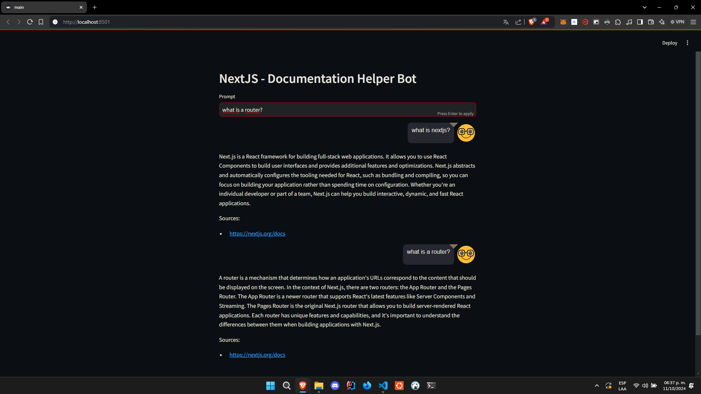

# Proyecto1: LLM-Chat

Este es un proyecto de chatbot basado en Python que utiliza el API de OpenAI para generar respuestas. El chat puede alimentarse de una base de datos vectorial construida en Pinecone con información proveniente de archivos HTML, obtenida mediante web scraping con Firecrawl.

## Características

- **OpenAI API**: Utiliza el API de OpenAI para generar respuestas inteligentes en un entorno conversacional.
- **Base de datos vectorial**: Pinecone es utilizado para almacenar y gestionar la información indexada, mejorando la precisión de las respuestas.
- **Web Scraping**: Firecrawl se encarga de recolectar datos desde sitios web para alimentar el chatbot con información relevante.
- **Interfaz gráfica**: Se usa Streamlit para crear una interfaz web amigable para interactuar con el chatbot.

## Tecnologías Utilizadas

- **Python**
- **Langchain y sus extensiones**: Para facilitar la creación del modelo del chatbot.
- **Pinecone**: Base de datos vectorial.
- **Firecrawl**: Web scraping.
- **Streamlit y Streamlit-Chat**: Para la interfaz de usuario.

## Repositorio

Puedes encontrar el código fuente del proyecto en el siguiente enlace: [LLM-CHAT - GitHub](https://github.com/Diegoval-Dev/LLM-CHAT).

## Setup

1. **Clonar el repositorio**:

   ```sh
   git clone https://github.com/Diegoval-Dev/LLM-CHAT.git
   cd LLM-CHAT
   ```

2. **Crear y activar un entorno virtual**:

   ```sh
   python -m venv myenv
   source myenv/Scripts/activate  # Windows
   source myenv/bin/activate      # Linux/Mac
   ```

3. **Instalar las dependencias**:

   ```sh
   pip install -r requirements.txt
   ```

## Uso

Para ejecutar el script principal:

```sh
streamlit run main.py
```

## Librerías Utilizadas

Este proyecto utiliza una variedad de librerías para diferentes funcionalidades. Algunas de ellas son:

- **Langchain** y extensiones:
  - langchain-community
  - langchain-core
  - langchain-text-splitters
  - langchain-openai
  - langchain-pinecone
  - langchainhub
  - langsmith
  - langgraph
- **Pinecone**: Para almacenamiento vectorial.
- **Firecrawl**: Herramienta para hacer web scraping.
- **OpenAI**: Integración con la API de OpenAI.
- **Streamlit** y **Streamlit-Chat**: Para la interfaz de usuario.
- **Otros**:
  - pypdf
  - faiss-cpu
  - requests
  - python-dotenv
  - beautifulsoup4
  - altair<5
  - black
  - google-search-results

## Contribuciones

Este proyecto ha sido desarrollado por [Diegoval-Dev](https://github.com/Diegoval-Dev), quien es el único contribuidor.

## Licencia

Este proyecto está bajo la licencia MIT. Consulta el archivo `LICENSE` para obtener más información.

---

¿Hay algo más que quisieras agregar o detallar en este README? Estoy aquí para ayudarte a hacer ajustes.
# Proyecto1: LLM-Chat

Este es un proyecto de chatbot basado en Python que utiliza el API de OpenAI para generar respuestas. El chat puede alimentarse de una base de datos vectorial construida en Pinecone con información proveniente de archivos HTML, obtenida mediante web scraping con Firecrawl.

## Características

- **OpenAI API**: Utiliza el API de OpenAI para generar respuestas inteligentes en un entorno conversacional.
- **Base de datos vectorial**: Pinecone es utilizado para almacenar y gestionar la información indexada, mejorando la precisión de las respuestas.
- **Web Scraping**: Firecrawl se encarga de recolectar datos desde sitios web para alimentar el chatbot con información relevante.
- **Interfaz gráfica**: Se usa Streamlit para crear una interfaz web amigable para interactuar con el chatbot.

## Tecnologías Utilizadas

- **Python**
- **Langchain y sus extensiones**: Para facilitar la creación del modelo del chatbot.
- **Pinecone**: Base de datos vectorial.
- **Firecrawl**: Web scraping.
- **Streamlit y Streamlit-Chat**: Para la interfaz de usuario.

## Repositorio

Puedes encontrar el código fuente del proyecto en el siguiente enlace: [LLM-CHAT - GitHub](https://github.com/Diegoval-Dev/LLM-CHAT).

## Setup

1. **Clonar el repositorio**:

   ```sh
   git clone https://github.com/Diegoval-Dev/LLM-CHAT.git
   cd LLM-CHAT
   ```

2. **Crear y activar un entorno virtual**:

   ```sh
   python -m venv myenv
   source myenv/Scripts/activate  # Windows
   source myenv/bin/activate      # Linux/Mac
   ```

3. **Instalar las dependencias**:

   ```sh
   pip install -r requirements.txt
   ```

## Uso

Para ejecutar el script principal:

```sh
python main.py
```

## Librerías Utilizadas

Este proyecto utiliza una variedad de librerías para diferentes funcionalidades. Algunas de ellas son:

- **Langchain** y extensiones:
  - langchain-community
  - langchain-core
  - langchain-text-splitters
  - langchain-openai
  - langchain-pinecone
  - langchainhub
  - langsmith
  - langgraph
- **Pinecone**: Para almacenamiento vectorial.
- **Firecrawl**: Herramienta para hacer web scraping.
- **OpenAI**: Integración con la API de OpenAI.
- **Streamlit** y **Streamlit-Chat**: Para la interfaz de usuario.
- **Otros**:
  - pypdf
  - faiss-cpu
  - requests
  - python-dotenv
  - beautifulsoup4
  - altair<5
  - black
  - google-search-results

## Contribuciones

Este proyecto ha sido desarrollado por [Diegoval-Dev](https://github.com/Diegoval-Dev)

## Foto




https://github.com/user-attachments/assets/b93a1418-e664-4a3a-8840-4dcc3512dfb9


